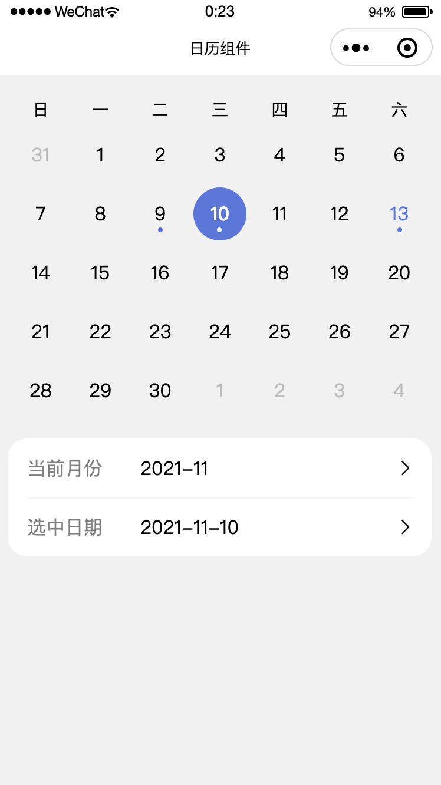

# 微信小程序原生简易日历组件

## 截图演示

## 使用说明

### 参数

| 名称 | 类型 | 动态监听 | 说明 |
| ---- | ---- | ---- | ---- |
| current-month | String | 是 | 当前显示的月份，格式为 YYYY-MM
| selected-date | String | 是 | 选中的日期，格式为 YYYY-MM-DD
| marked-dates | Array | 是 | 特殊标记的日期，格式为 [YYYY-MM-DD]
| start-date | String | 否 | 限制可选日期的左边界，格式为 YYYY-MM-DD
| end-date  | String | 否 | 限制可选日期的右边界，格式为 YYYY-MM-DD
| show-extra-dates | Boolean | 否 | 是否显示上个月的最后几天和下个月的前几天用于填充日历的空白位置

### 事件

| 名称 | 说明 | 参数
| ---- | ---- | ---- |
| swipe | 滑动切换月份时触发 | { year: number, month: number }
| select | 点击选中日期时触发 |  { year: number, month: number, date: number }
