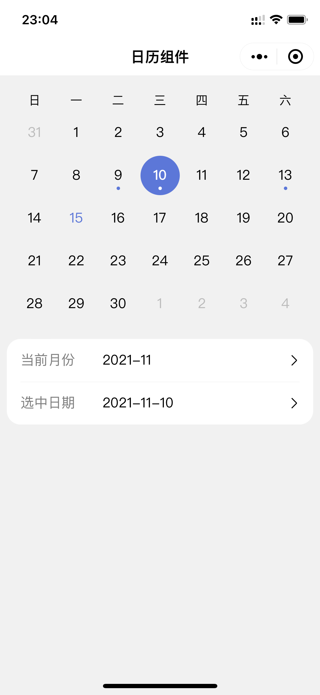

# 微信小程序原生简易日历组件

使用 TypeScript + LESS 编写的微信小程序日历组件，具有以下优势：

- 采用原生框架，设计简易，易于移植且可拓展性较强；
- 支持左右滑动无缝切换月份；
- 支持限制可选的日期范围；
- 支持自定义特殊标记的日期。

## 截图演示

## 使用说明

### 要求

1. 使用 1.05.2110110 Stable 及以上版本的开发者工具（支持 TypeScript 和 LESS）；
2. 在 project.config.json 文件中，修改 `setting` 下的 `useCompilerPlugins` 字段为 ["typescript", "less"]。

### 使用

1. 复制 calendar 文件夹到所需的项目目录；
2. 遵循微信小程序自定义组件的引用规则，按照 index/index.wxml 文件演示的使用方法定制使用。

### 自定义样式

请直接修改 calendar.less 文件。

### 参数

| 名称 | 类型 | 动态监听 | 说明 |
| ---- | ---- | ---- | ---- |
| current-month | String | 是 | 当前显示的月份，格式为 YYYY-MM
| selected-date | String | 是 | 选中的日期，格式为 YYYY-MM-DD
| marked-dates | Array | 是 | 特殊标记的日期，格式为 [YYYY-MM-DD]
| start-date | String | 否 | 限制可选日期的左边界，格式为 YYYY-MM-DD
| end-date  | String | 否 | 限制可选日期的右边界，格式为 YYYY-MM-DD
| show-extra-dates | Boolean | 否 | 是否显示上个月的最后几天和下个月的前几天用于填充日历的空白位置

### 事件

| 名称 | 说明 | 参数
| ---- | ---- | ---- |
| swipe | 滑动切换月份时触发 | { year: number, month: number }
| select | 点击选中日期时触发 |  { year: number, month: number, date: number }
