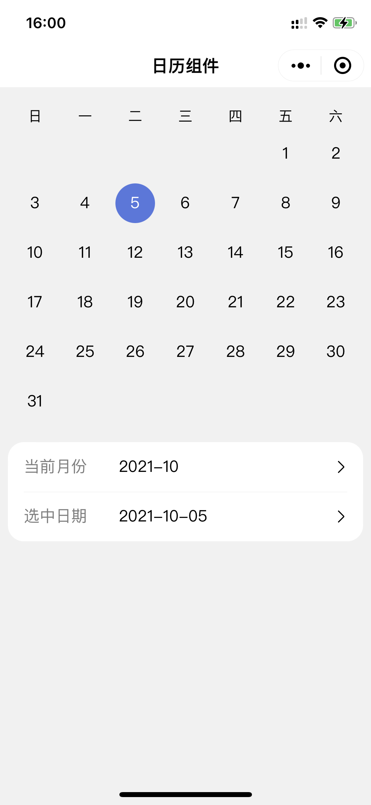

# 微信小程序原生简易日历组件

## 截图演示

## 使用说明

### 参数

| 名称 | 类型 | 说明 |
| ---- | ---- | ---- |
| current-month | String | 当前显示的月份，格式为 YYYY-MM
| selected-date | String | 选中的日期，格式为 YYYY-MM-DD
| start-date | String | 限制可选日期的左边界，格式为 YYYY-MM-DD
| end-date  | String | 限制可选日期的右边界，格式为 YYYY-MM-DD
| show-former-dates | Boolean | 是否显示上个月的后几天用于填充日历的第一行
| show-later-dates | Boolean | 是否显示下个月的前几天用于填充日历的最后一行

### 事件

| 名称 | 说明 |
| ---- | ---- |
| swipe | 滑动切换月份时触发
| select | 点击选中日期时触发